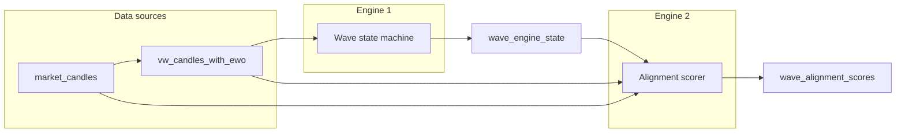

# Engine 2: Alignment (confidence) engine

Engine 2 is a **deterministic confidence layer** that runs after Engine 1. It does not change wave labels. It reads Engine 1 output plus EWO, ATR, and volume and writes scores per candle to `wave_alignment_scores`.

## Relationship with Engine 1

- **Engine 1** reads `vw_candles_with_ewo` (EWO, mean, sma_5, sma_35, OHLC) and writes **wave_engine_state** (one row per candle: trend_direction, wave_number, wave_phase, flags, peaks). Run first via POST `/api/wave-engine/run` or equivalent.
- **Engine 2** runs after Engine 1. It reads **wave_engine_state**, **vw_candles_with_ewo**, and **market_candles** (ATR, volume) through the single view **vw_alignment_engine_input**, and writes **wave_alignment_scores** (alignment_score, wave3_probability, wave5_exhaustion_probability, sub-scores). Engine 2 does not modify wave labels.

## Purpose

- **alignment_score** (0–1): Overall quality/alignment of the current bar.
- **wave3_probability** (0–1): Confidence that structure is continuation-friendly (Wave 3).
- **wave5_exhaustion_probability** (0–1): Risk of late-stage impulse exhaustion.
- Sub-scores: momentum strength, multi-TF stack, volatility regime, divergence (stored as health: higher = better).

No prediction of future candles; repeatable rules only.

## Inputs

Single read contract: view **vw_alignment_engine_input** (join of):

- **wave_engine_state**: symbol, timeframe, timestamp, trend_direction, wave_number, wave_phase, wave_peak_ewo, wave_peak_price, zero_cross_flag, engine_reset_flag, wave_start_time
- **vw_candles_with_ewo**: ewo, sma_5, sma_35, mean, high
- **market_candles** (left join): atr, volume

Join keys: (symbol, timeframe, timestamp) with wave/candles; (symbol, timeframe, eastern_time = timestamp) for market_candles. ATR/volume may be null; engine handles gracefully.

## Output table: wave_alignment_scores

| Column | Type | Description |
|--------|------|-------------|
| symbol | text | |
| timeframe | text | |
| timestamp | timestamptz | Bar identity |
| alignment_score | numeric | 0–1 weighted blend |
| wave3_probability | numeric | 0–1 |
| wave5_exhaustion_probability | numeric | 0–1 |
| momentum_strength_score | numeric | 0–1 |
| multi_tf_stack_score | numeric | 0–1 (higher-TF Wave 3 alignment) |
| volatility_regime_score | numeric | 0–1 (expansion in W3, contraction in W5) |
| divergence_score | numeric | 0–1 **health** (higher = less divergence risk) |
| notes | text | Optional (e.g. "divergence", "stack_high") |

Primary key: (symbol, timeframe, timestamp).

## Weights

Table **wave_alignment_weights** (id = `'default'`). Weights must sum to 1 (tolerance 0.001).

| Weight | Default |
|--------|--------|
| momentum_weight | 0.30 |
| stack_weight | 0.30 |
| volatility_weight | 0.15 |
| divergence_weight | 0.15 |
| wave_context_weight | 0.10 |

alignment_score = momentum×w_m + stack×w_s + volatility×w_v + divergence_health×w_d + context×w_c.

## Scoring (summary)

- **Momentum:** |EWO|/ATR (capped), EWO slope; 0.75×magnitude + 0.25×slope. Null ATR: magnitude-only fallback.
- **Stack:** Timeframe hierarchy 1W, 1D, 360, 90, 23. Resolve bar start per TF; count rows with wave_number = '3'. Map aligned ratio to 0.10–1.00.
- **Volatility:** ATR vs 5-period SMA; expansion/contraction. W3 → expansion score; W5 → contraction; else 0.5.
- **Divergence:** Running max price and EWO per impulse (reset on zero_cross_flag, engine_reset_flag). Price new high but EWO below prior peak → risk. Stored as **health** = 1 − risk.
- **Wave context:** W3=1.0, W5=0.8, W4=0.4, else 0.2.
- **Probabilities:** wave3_probability uses momentum, stack, volatility expansion; capped when wave_number ≠ 3. wave5_exhaustion_probability uses divergence risk, volatility contraction, inverse momentum; capped when wave_number ≠ 5.

## Run and validate

- **Run (CLI):** `npm run run-alignment-engine` or `npx tsx scripts/run-alignment-engine.ts [--symbol SYMBOL] [--timeframe TF] [--from ISO] [--to ISO] [--full-rebuild]`. Requires Engine 1 to have populated `wave_engine_state`; market DB env (NEXT_PUBLIC_SUPABASE_MARKET_*).
- **Run (API):** POST `/api/alignment-engine/run` with body `{ symbol?, timeframe?, from?, to?, fullRebuild? }`.
- **Latest per TF:** View `vw_alignment_scores_latest_per_tf`; filter by symbol for one-symbol report.
- **Validation SQL:** [alignment-engine-validation.sql](alignment-engine-validation.sql) (three windows: impulse, chop, terminal).
- **Validation script:** `npm run validate-alignment-engine` with `--symbol` and `--impulse-from`, `--impulse-to`, `--chop-from`, `--chop-to`, `--terminal-from`, `--terminal-to`.

## Code

- **Types/weights:** [lib/alignment-engine/types.ts](../../../lib/alignment-engine/types.ts), [lib/alignment-engine/weights.ts](../../../lib/alignment-engine/weights.ts)
- **Bar resolution:** [lib/alignment-engine/timeframe-resolver.ts](../../../lib/alignment-engine/timeframe-resolver.ts)
- **Scoring:** [lib/alignment-engine/scores.ts](../../../lib/alignment-engine/scores.ts)
- **Runner:** [lib/alignment-engine/runner.ts](../../../lib/alignment-engine/runner.ts)
- **Migration:** [supabase-portable/migrations/wave_alignment_scores.sql](../../../supabase-portable/migrations/wave_alignment_scores.sql)
