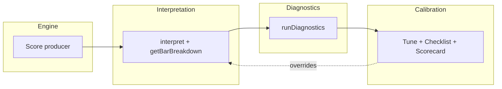

# Engine 2 architecture

Engine 2 is the alignment/confidence layer: it consumes scores (and wave context) and produces alignment, confidence, and bias states. This doc defines the four layers and the hub’s role.

## Layers

- **Engine**: Produces scores (alignment_score, wave3/5 probs, stack, momentum, etc.). Backend/DB; out of scope for this app.
- **Interpretation**: Consumes scores + wave context; applies thresholds; produces alignment/confidence/bias states. Implemented in `lib/interpretation-engine.ts` and `app/api/alignment-engine/interpretation/route.ts`.
- **Diagnostics**: Runs interpretation over many bars and summarizes (gating %, bands, rules fired). Implemented in `app/api/alignment-engine/diagnostics/route.ts`; used by Diagnostic flow and aggregate-diagnostics panel.
- **Calibration**: Tune thresholds, version configs, checklist, and scorecard to evaluate and adjust behavior. Implemented in Tune, Checklist, Scorecard, version store, and logic config.

## Hub UI

Single entry: **Reference** | **Diagnostics** | **Evaluate** | **Tune**.

- **Reference**: Static decision ladder (alignment → confidence → bias) and default numbers.
- **Diagnostics**: Load/clear and view per-TF diagnostic tables; version in use and active thresholds at top.
- **Evaluate**: Checklist and Scorecard (same checklist state); flow = run diagnostics elsewhere, then evaluate here.
- **Tune**: Versions and gates; set active config used by interpretation and diagnostics site-wide.

## Extension points

Future “SMC layer” or “fractal correlations” can plug in:

- **After Interpretation**: Extra inputs to the interpretive layer (e.g. SMC structure, fractal density) as additional inputs to `interpret()` or a parallel path that merges into diagnostics.
- **Calibration**: Additional data or tabs in the hub (e.g. SMC-specific thresholds, fractal calibration) using the same version store and config pattern.

No implementation here; the hub and version store are the right place to add new surfaces.

## Calibration workflow

1. Run diagnostics (Diagnostics tab or aggregate panel from chart).
2. Evaluate (Checklist then Scorecard in Evaluate tab).
3. Tune (adjust thresholds, create version, set active in Tune tab).
4. Repeat.

Future batch runs (e.g. compare two versions) are out of scope for this restructure; the hub and version store are the right place to add them.
